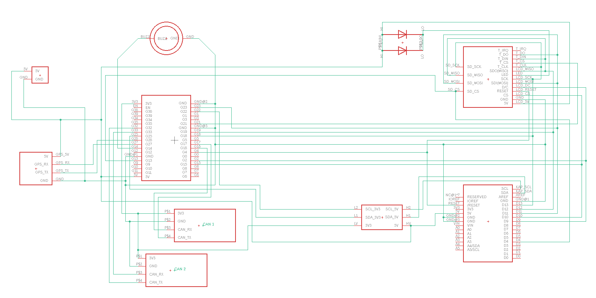

# Platine V5

von erich (eokgnah)

<pre>
!!!!!!!!!!!!!!!!!!!!!!!!!!!!!!!!!!!!!!!!!!!!!!!!!!!!!!!!!!!!!!!!!!
!!!! OHNE GEWÄHR, ALLES AUF EIGENE GEFAHR, NUR ZU TESTZWECKEN !!!!
!!!!!!!!!!!!!!!!!!!!!!!!!!!!!!!!!!!!!!!!!!!!!!!!!!!!!!!!!!!!!!!!!!
</pre>

Im Zip-Archiv befinden sich die Gerber-Dateien zur Herstellung der Platine (z.B. bei https://jlcpcb.com/).

Diese Platine wird über die USB-Buchse des R-Link versorgt. Alternativ kann ein externer Spannungsregler von 12 V auf 5 V genutzt werden, um über die OBD-Buchse versorgt zu werden. In diesem Fall sollte ein manueller Ein-/Ausschalter vorgeschaltet werden, da das Display sonst permanent aktiv wäre und eventuell die 12-V-Batterie zu tief entladen könnte.

Es kann nur das Display mit kapazitivem Touchscreen verwendet werden, da beim resistiven ein Verkabelungsfehler vorliegt.

## Verwendete Bauteile

- ESP32 Development Board (z.B. https://www.amazon.de/gp/product/B071P98VTG)
- Adafruit 2,8 Zoll 240 x 320 TFT Panel mit kapazitivem Touchscreen (ADA1947, https://www.amazon.de/gp/product/B00R3R65C0/)
- CAN-Transceiver-Modul SN65HVD230 (z.B. https://www.amazon.de/gp/product/B00KM6XMXO/)
- Level Shifter 3,3 V <-> 5 V (für SDA und SCL des Displays)
- GPS-Modul (z.B. https://www.amazon.de/gp/product/B01N38EMBF/)
- Kleinteile (CAN-Stecker für OBD Buchse, Piezo-Summer, USB-Kabel und -Buchse, etc.)

## Verbindungsübersicht
<pre>
ESP32 Dev Board Pinout

Wohin       Bezeich.       ESP32 Pins       Bezeich.    Wohin

CAN                     3V3         GND
                        EN          G23     SPI MOSI    Display
                        G36         G22     I2C SCL     Display
                        G39         G1      (TX)
                        G34         G3      (RX)
            (CAN2 RX)   G35         G21 
            (CAN2 TX)   G32         GND
                        G33         G19     SPI MISO    Display
Display     I2C SDA     G25         G18     SPI SCLK    Display
GPS         GPS TX      G26         G5
GPS         GPS RX      G27         G17     CAN TX      CAN Bus
BUZZER+                 G14         G16     CAN RX      CAN Bus 
                        G12         G4      RST         Display
Display,CAN,GPS         GND         G0      (BOOT)
Display     CARDCS      G13         G2      DC          Display
            (Flash)     G9          G15     CS          Display
            (Flash)     G10         G8      (Flash)
            (Flash)     G11         G7      (Flash)
GPS,Display             5V          G6      (Flash)
</pre>                    
Die beiden Leitungen für den I2C Bus (SCL und SDA) müssen über einen Level Shifter geführt 
werden (sowohl ESP32 als auch das Display arbeiten mit Pull Ups auf VCC. Der ESP32 allerdings 
mit 3.3 Volt, das Display mit 5 Volt. Würde nicht ausprobieren wollen, wer ohne Level Shifter gewinnt...)
RX und TX gibt den Pin an, mit dem es verbunden werden muss. GPS TX muss also auf den Pin
TX am GPS Modul! 

CAN2 ist derzeit experimentell. 

## Schaltplan

Rechts unten ist das kapazitive Display. Rechts oben das als Alternative gedachte Display mit resistivem Touchscreen, 
welches aber nicht verwendet werden kann, da ein Verdrahtungsfehler vorliegt! Die beiden Dioden werden somit auch nicht benötigt.
