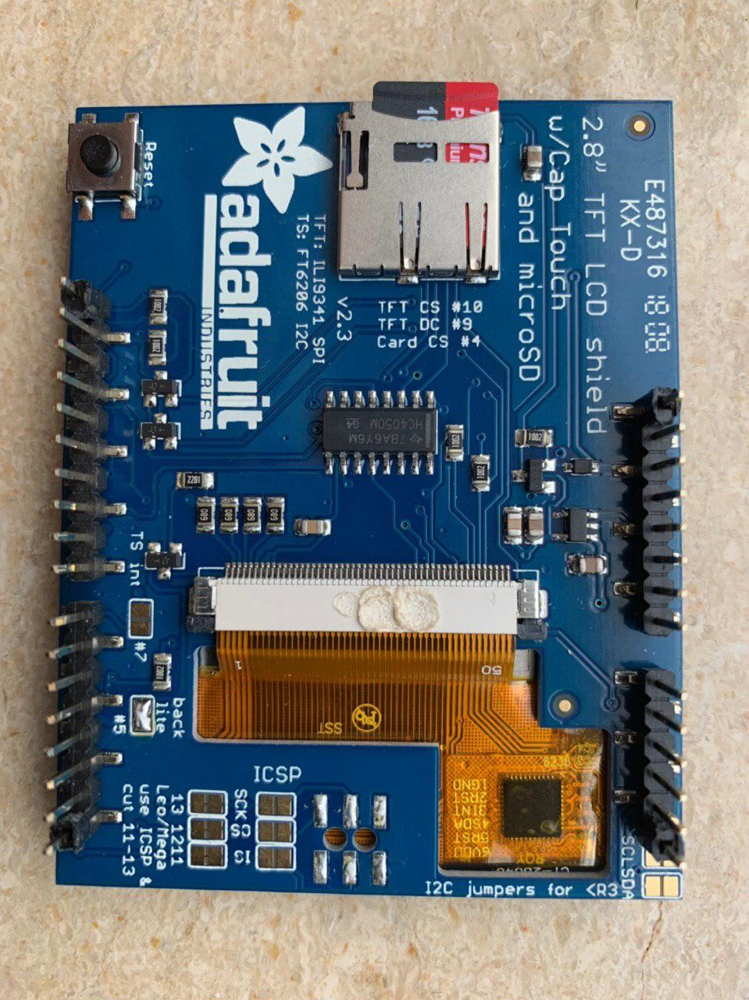

# Platine V8

von Michi (kepppfeff-ZOE)

<pre>
!!!!!!!!!!!!!!!!!!!!!!!!!!!!!!!!!!!!!!!!!!!!!!!!!!!!!!!!!!!!!!!!!!
!!!! OHNE GEWÄHR, ALLES AUF EIGENE GEFAHR, NUR ZU TESTZWECKEN !!!!
!!!!!!!!!!!!!!!!!!!!!!!!!!!!!!!!!!!!!!!!!!!!!!!!!!!!!!!!!!!!!!!!!!
</pre>

## Benötigte Bauteile

Zusätzlich zu den unter https://github.com/eokgnah/ZOE-Display aufgelisteten Hauptkomponenten und dem 3D-Druck werden folgende Bauteile benötigt (diese sind alle bei der Sammelbestellung enthalten):

#### Module & Halbleiter
- U2: Spannungsregler LC78_05-0.5 oder vergleichbar (Ausgang 5 V, 500 mA) bzw. bei Anschluss einer USB-Buchse 1× Spannungsregler OKI-78SR-5/1.5-W36-C oder vergleichbar (Ausgang 5 V, 1500 mA)
- U3: Spannungsregler LC78_03-0.5 oder vergleichbar (Ausgang 3,3 V, 500 mA)
- Q1: P-Kanal-MOSFET IRFU9024N
- IC4: CAN-Transceiver MCP2562 (DIP8)
- D3, D4: Schottky-Diode 1N5817
- T1: NPN-Transistor BC547C (nur bei Verwendung des kapazitiven Displays)
- T4: PNP-Transistor BC327-25
- T5, T6: NPN-Transistoren BC547C

#### Passive Bauelemente
- R1: Widerstand 100 kΩ ± 50 % (nur bei Verwendung des kapazitiven Displays)
- R3: Widerstand 1,5 kΩ ± 5 % (nur bei Verwendung des resistiven Displays mit eingebautem Transistor) bzw. Widerstand 5,1 Ω ± 5 % (nur bei Verwendung des resistiven Displays ohne eingebauten Transistor)
- R4: Widerstand 15 kΩ ± 5 % (nur bei Verwendung des kapazitiven Displays der alten Version)
- R5: Widerstand 120 Ω ± 10 %
- R6: Widerstand 15 kΩ ± 5 %
- R7: Widerstand 15 kΩ ± 5 % (nur bei Verwendung des kapazitiven Displays der alten Version)
- R8: Widerstand 100 kΩ ± 5 %
- R9: Widerstand 470 kΩ ± 10 %
- R10, R11: Widerstände 1,2 MΩ ± 5 %
- R12: Widerstand 470 kΩ ± 5 %
- R13: Widerstand 47 kΩ ± 5 %
- C1: Elektrolyt-Kondensator 10 μF, min. 10 V
- C2, C3, C4: Keramik-Kondensatoren 100 nF
- C5: Elektrolyt-Kondensator 10 μF, min. 25 V
- C6: Elektrolyt-Kondensator 22 μF, min. 6,3 V

#### Steckverbinder & Elektromechanik
- OBD-Stecker
- Piezo-Summer, mit Kabeln oder für Printmontage (RM 7,6 mm)
- IC-Sockel DIP8 (für MCP2562)
- USB-Buchse (optional)
- Schraubklemmblock 3-polig (RM 5 mm) für Stromversorgung (12 V Eingang, 5 V Ausgang)
- Schraubklemmblock 2-polig (RM 5 mm) für CAN-Bus
- Kabel zum Anschluss von OBD-Stecker und USB-Buchse
- Stiftleisten (für GPS-Modul, resistives Display und ggf. als Abstandshalter)

## Benötigtes Werkzeug und Verbrauchsmaterial
Zum Zusammenbau der Elektronik benötigt ihr folgendes:
- Lötkolben
- Lot
- Seitenschneider bzw. Vornschneider
- Spitzzange
- Abisolierzange
- Schlitz-Schraubendreher

## Hinweise zum resistiven Touchscreen

Falls ihr das Display mit resistivem Touchscreen verwendet, solltet ihr zunächst prüfen, ob dieses einen eingebauten Transistor für die LED-Hintergrundbeleuchtung eingebaut hat oder nicht. Nur wenn ein Transistor eingebaut ist, könnt ihr die Helligkeit des Displays verändern.
Von der Versionsbezeichnung des Displays hängt dies scheinbar nicht ab; ich habe schon Bilder von V1.1 und V1.2 jeweils sowohl mit und ohne Transistor gesehen! Ihr müsst also wirklich den Transistor auf der Platine suchen. Es handelt sich um ein kleines schwarzes Bauteil mit 3 Pins, welches auf der Platine mit **Q1** beschriftet sein muss. Zusätzlich gibt es noch ein gleich aussehendes Bauteil, welches mit U1 beschriftet ist (das ist kein Transistor, sondern ein Spannungsregler). 
- Falls euer Display *zwei* kleine schwarze Bauteile mit 3 Pins hat, von denen eines mit U1 und eines mit Q1 beschriftet ist, dann habt ihr ein Display *mit* eingebautem Transistor.
- Falls euer Display nur *ein* kleines schwarzes Bauteil mit 3 Pins hat, welches auf der Platine mit U1 beschriftet ist, dann hat das Display *keinen* Transistor eingebaut. 

## Hinweise zum kapazitiven Touchscreen

Falls ihr das Display mit kapazitivem Touchscreen verwendet, solltet ihr zunächst prüfen, ob ihr die alte oder die neue Version des Display besitzt.
### Alte Version

### Neue Version

## Platine löten
### Schritt 1: Lötbrücken setzen

### Schritt 2: Widerstände und Dioden

### Schritt 3: IC-Sockel

### Schritt 4: Keramik-Kondensatoren

### Schritt 5: Stiftleiste für GPS-Modul

### Schritt 6: Piezo-Summer

### Schritt 7: ESP32

### Schritt 8: Schraubklemmblöcke

### Schritt 9: Transistoren

### Schritt 10: 3,3-V-Spannungsregler

### Schritt 11: Elektrolyt-Kondensatoren

### Schritt 12: 5-V-Spannungsregler

### Schritt 13: Display

### Schritt 14: GPS-Modul

### Schritt 15: IC einsetzen

