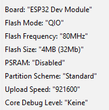
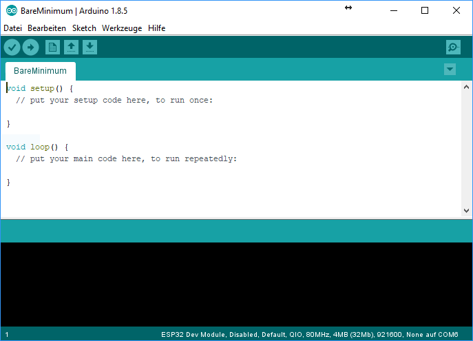
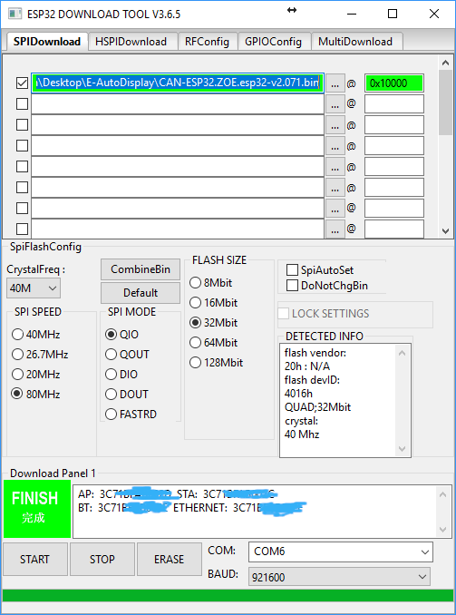

## Software

Anleitung von Erich (eokgnah)

<pre>
!!!!!!!!!!!!!!!!!!!!!!!!!!!!!!!!!!!!!!!!!!!!!!!!!!!!!!!!!!!!!!!!!!
!!!! OHNE GEWÄHR, ALLES AUF EIGENE GEFAHR, NUR ZU TESTZWECKEN !!!!
!!!!!!!!!!!!!!!!!!!!!!!!!!!!!!!!!!!!!!!!!!!!!!!!!!!!!!!!!!!!!!!!!!
</pre>

1. Holt euch die Arduino-IDE: 
https://www.arduino.cc/en/Main/Software

2. Macht die IDE bereit für den ESP32: (VERSION 1.0.2 verwenden für SOFTWARE ab 2.112, sonst 1.0.1)
https://randomnerdtutorials.com/installing-the-esp32-board-in-arduino-ide-windows-instructions/

3. Kontrolliert die Einstellungen und installiert auf Eurem neuen ESP32 zum Initialisieren den „bare minimum“-Sketch aus den Beispielen (COM-Port kann bei Euch ggf. ein anderer sein).

Wenn das alles sauber durchgelaufen ist, dann geht es weiter.

4. Holt Euch die „Flash Download Tools (ESP8266 & ESP32)“ von espressif: 
https://www.espressif.com/en/support/download/other-tools

5. Holt Euch das ZOE-Display-Binary (oben in der Ordnerstruktur die entsprechende Datei auswählen oder direkt über den Link https://github.com/eokgnah/ZOE-Display/raw/master/Software/CAN-ESP32.ZOE.esp32-v2.075.bin).

6. Startet die „Flash Download Tools (ESP8266 & ESP32)“, wählt den ESP32 aus und stellt ihn wie folgt ein (COM-Port kann bei Euch ggf. ein anderer sein):

7. Auf „START“ drücken und ihn flashen lassen.

8. Wenn er fertig ist, dann könnt Ihr beim ESP mal auf Reset drücken oder ihn kurz vom USB-Strom nehmen, damit er bootet.

9. Es sollte nun ein offener WLAN-Accesspoint (Name so etwas wie „ESP_12BA5C“ oder „ZOE“) bei Euch erschienen sein. 

10. Mit dem WLAN verbinden und auf die IP „192.168.4.1“ mit dem Browser gehen und dann könnt Ihr alles von dort aus über den Browser weiter konfigurieren.

Das alles geht auch nur mit dem ESP32 alleine.
Damit es „sinnvoll“ funktioniert ist es natürlich von Vorteil, wenn Ihr das Display, die SD-Karte, GPS und das CAN-Interface mit anschließt.  

Neuere Updates kommen dann per WLAN „over the air“.
Diese beschriebene Vorgehensweise ist nur ein einziges Mal am Anfang nötig. Danach braucht Ihr keinen PC mehr.
